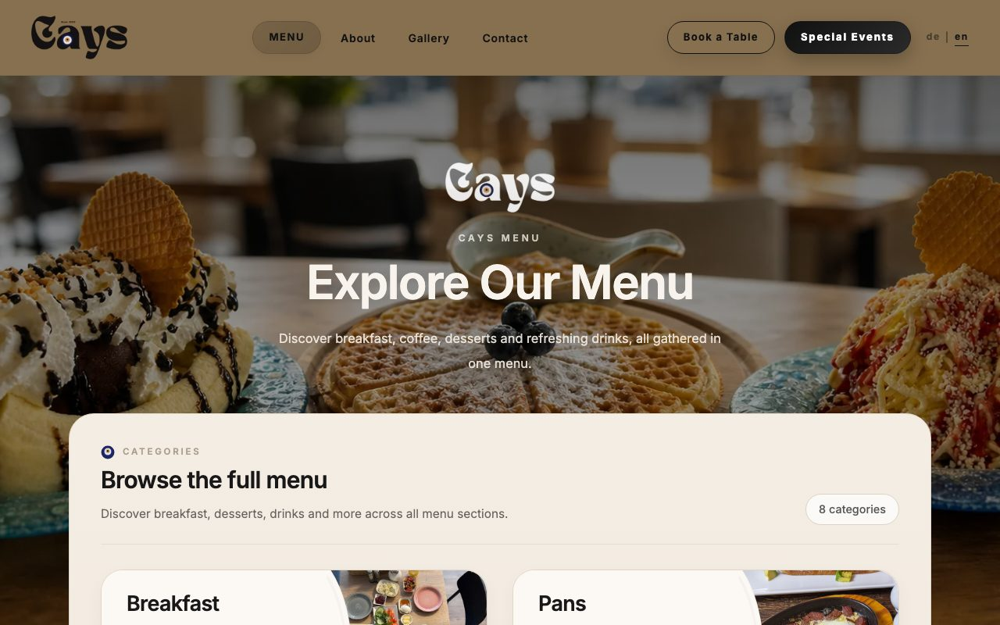
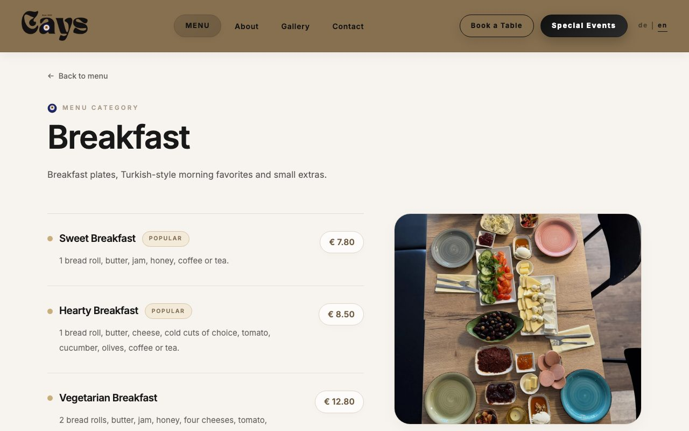
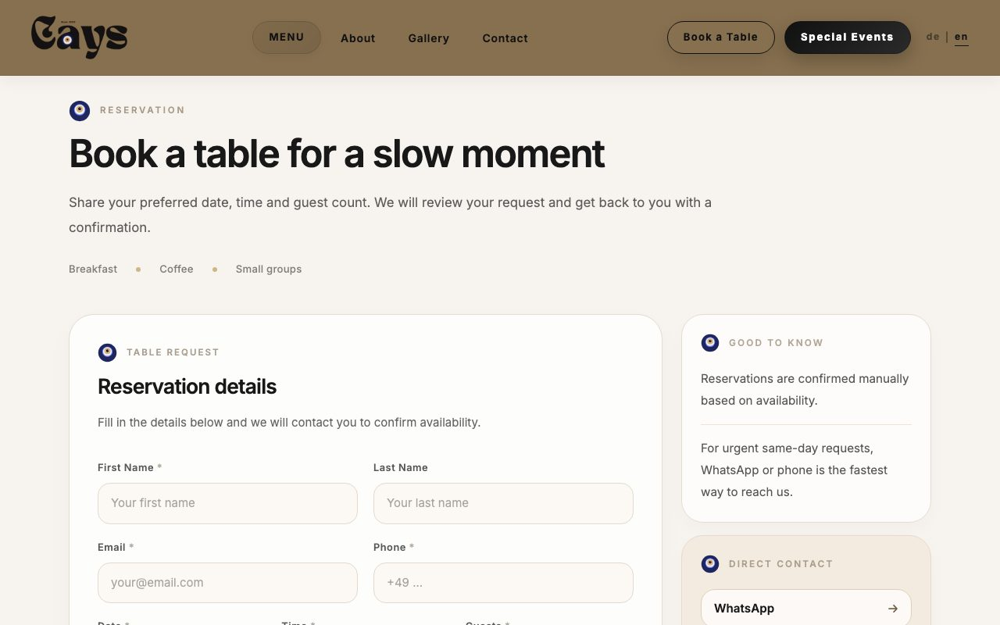
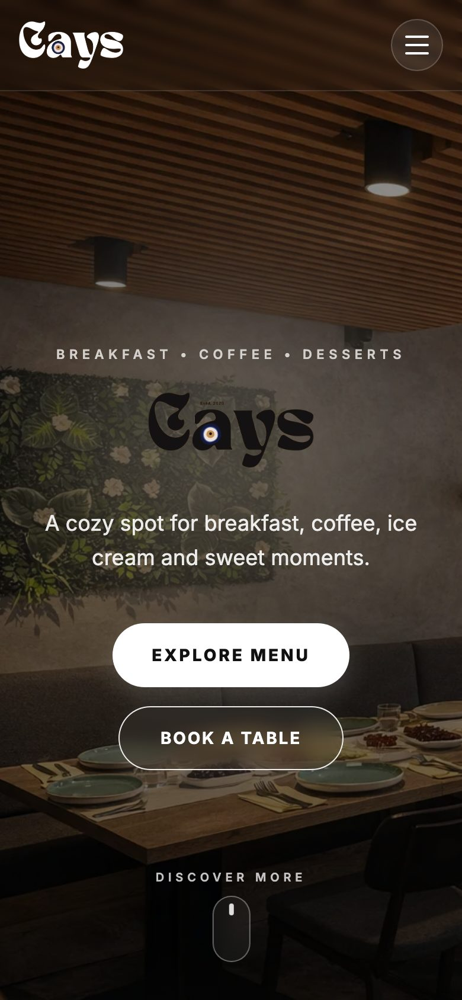

# Cays

A static marketing website for **Cays**, a café/breakfast restaurant in
Lörrach-Brombach, Germany. Bilingual (English/German), no backend of its own —
all content (menu, images, translations) is hardcoded in `src/data` and
`src/i18n`, and the contact/reservation forms are delivered by email through
[Web3Forms](https://web3forms.com/).


## Screenshots

| Menu overview | Menu category |
| --- | --- |
|  |  |
| **Table reservation form** | **Mobile** |
|  |  |

## Tech stack

- [React 19](https://react.dev/) + [TypeScript](https://www.typescriptlang.org/)
- [Vite](https://vite.dev/) for the dev server and build
- [React Router v7](https://reactrouter.com/) for routing, with route-based
  code splitting via `React.lazy`
- [Tailwind CSS v4](https://tailwindcss.com/) (CSS-first config, no
  `tailwind.config.js`)
- Self-hosted variable font via `@fontsource-variable/inter`
- [react-icons](https://react-icons.github.io/react-icons/) for icons

## Getting started

```bash
npm install
npm run dev
```

The dev server runs at `http://localhost:5173` by default.

## Scripts

```bash
npm run dev       # start the Vite dev server
npm run build     # type-check (tsc -b) and build for production
npm run lint      # run ESLint
npm run preview   # preview a production build locally
```

There is no test suite configured in this repo.

## Routes

| Path | Page |
| --- | --- |
| `/` | Home |
| `/menu` | Menu overview |
| `/menu/:slug` | Menu category — slugs: `breakfast`, `pfannen`, `toasts`, `waffles`, `cakes`, `hot-drinks`, `cold-drinks`, `alcohol` |
| `/about` | About |
| `/gallery` | Gallery |
| `/contact` | Contact |
| `/reservations/table` | Table reservation |
| `/reservations/events` | Event reservation |
| `/impressum` | Legal notice (German Impressumspflicht) |
| `*` | 404 |

## Project structure

```
src/
  components/   # shared UI components
  pages/        # one component per route
  layouts/      # MainLayout (Navbar + Outlet + Footer)
  router/       # route definitions
  data/         # hardcoded menu/category/image data
  i18n/         # translations + language context (en/de)
  hooks/        # shared hooks (scroll tracking, page <title>/meta, in-view)
  utils/        # form submission (Web3Forms), German email formatting, WhatsApp link
  types/        # shared TypeScript types
public/images/  # served as-is, referenced by plain string paths
public/robots.txt, public/sitemap.xml  # SEO
```

## Forms

The contact, table-reservation and event-reservation forms post to Web3Forms
(`src/utils/web3forms.ts`) from the browser, so submissions arrive by email
without a page reload. Email field labels are always built in German
(`src/utils/formMessages.ts`), regardless of the site language; free text the
visitor types is passed through unchanged. The Web3Forms access key is a
public, client-side key by design.

## Deployment

Hosted on [Vercel](https://vercel.com/) (Vite preset, output `dist/`); every
push to `main` deploys automatically. Large images should be committed as
WebP and kept out of `public/` unless the site actually references them, since
everything in `public/` ships to production.

## i18n

Language is stored in `src/i18n/translations.ts` (one object per language) and
persisted to `localStorage`. When adding UI copy, add the key to **both** the
`en` and `de` blocks in the same nested location.

## SEO

`index.html` includes Open Graph/Twitter meta tags and `CafeOrCoffeeShop`
JSON-LD structured data. These currently point at a placeholder domain
(`cays-cafe.com`) — replace it once the real production domain is live, in
`index.html`, `public/robots.txt`, and `public/sitemap.xml`.

## Known TODOs

- Replace the Web3Forms access key in `src/utils/web3forms.ts` with the
  business owner's own key, and fill in the real WhatsApp number in
  `src/utils/whatsapp.ts` (it is currently empty).
- `hello@cays-cafe.com` (Contact page, Impressum) is a placeholder address.
- `src/pages/ImpressumPage.tsx` has bracketed placeholders for the legal
  operator name, VAT ID, and commercial register — required before the site
  can legally go live in Germany.
- The SEO placeholder domain (see above) needs to be swapped for the real one.

## License & content

No license is granted: all rights reserved. The café's photos, logo and menu
belong to their owners; some category photos are Unsplash stock images
(free to use under the Unsplash License).
