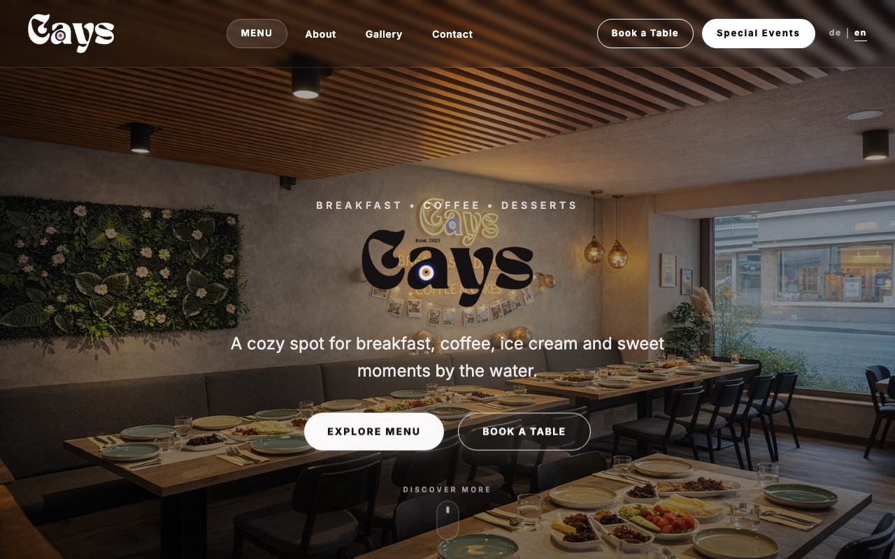

# Cays

A static marketing website for **Cays**, a café/breakfast restaurant in
Lörrach-Brombach, Germany. Bilingual (English/German), no backend — all
content (menu, images, translations) is hardcoded in `src/data` and
`src/i18n`.



## Tech stack

- [React 19](https://react.dev/) + [TypeScript](https://www.typescriptlang.org/)
- [Vite](https://vite.dev/) for the dev server and build
- [React Router v7](https://reactrouter.com/) for routing, with route-based
  code splitting via `React.lazy`
- [Tailwind CSS v4](https://tailwindcss.com/) (CSS-first config, no
  `tailwind.config.js`)
- Self-hosted variable font via `@fontsource-variable/inter`
- [react-icons](https://react-icons.github.io/react-icons/) for icons

## Getting started

```bash
npm install
npm run dev
```

The dev server runs at `http://localhost:5173` by default.

## Scripts

```bash
npm run dev       # start the Vite dev server
npm run build     # type-check (tsc -b) and build for production
npm run lint      # run ESLint
npm run preview   # preview a production build locally
```

There is no test suite configured in this repo.

## Routes

| Path | Page |
| --- | --- |
| `/` | Home |
| `/menu` | Menu overview |
| `/menu/:slug` | Menu category (breakfast, pans, toasts, waffles, cakes, hot/cold drinks, alcohol) |
| `/about` | About |
| `/gallery` | Gallery |
| `/contact` | Contact |
| `/reservations/table` | Table reservation |
| `/reservations/events` | Event reservation |
| `/impressum` | Legal notice (German Impressumspflicht) |
| `*` | 404 |

## Project structure

```
src/
  components/   # shared UI components
  pages/        # one component per route
  layouts/      # MainLayout (Navbar + Outlet + Footer)
  router/       # route definitions
  data/         # hardcoded menu/category/image data
  i18n/         # translations + language context (en/de)
  hooks/        # shared hooks (scroll tracking, page <title>/meta, in-view)
  types/        # shared TypeScript types
public/images/  # served as-is, referenced by plain string paths
public/robots.txt, public/sitemap.xml  # SEO
```

See [CLAUDE.md](./CLAUDE.md) for a more detailed architecture write-up.

## i18n

Language is stored in `src/i18n/translations.ts` (one object per language) and
persisted to `localStorage`. When adding UI copy, add the key to **both** the
`en` and `de` blocks in the same nested location.

## SEO

`index.html` includes Open Graph/Twitter meta tags and `CafeOrCoffeeShop`
JSON-LD structured data. These currently point at a placeholder domain
(`cays-cafe.com`) — replace it once the real production domain is live, in
`index.html`, `public/robots.txt`, and `public/sitemap.xml`.

## Known TODOs

- The reservation and contact forms currently only prevent the default page
  reload on submit — they are not yet wired up to a real backend, email, or
  WhatsApp integration (see the `TODO` comments in the relevant page files).
- A few menu images in `src/data/menu.ts` are temporary Unsplash placeholders
  pending real product photography.
- `src/pages/ImpressumPage.tsx` has bracketed placeholders for the legal
  operator name, VAT ID, and commercial register — required before the site
  can legally go live in Germany.
- The SEO placeholder domain (see above) needs to be swapped for the real one.
